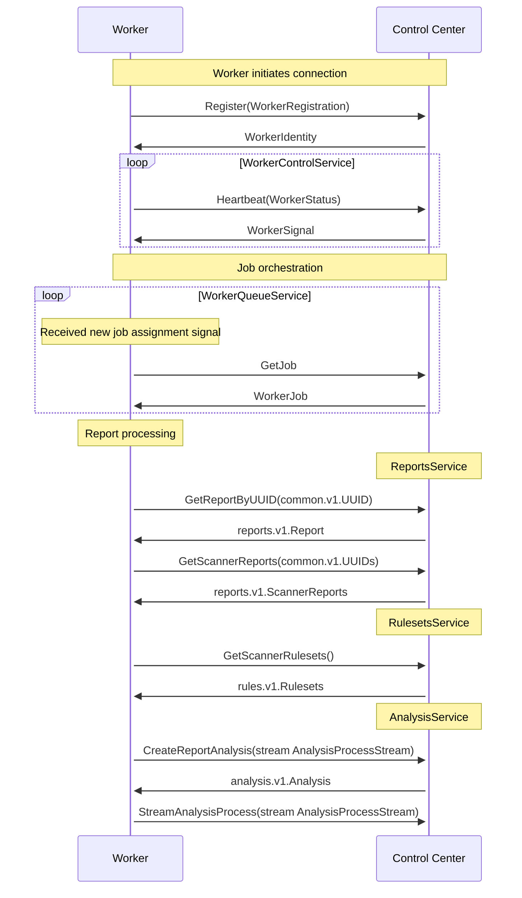

# Dolina ASPM API

## Features

## Project structure

```
internal/
└── entities/
    └── model1.go
    └── model2.go
    └── model3.go
└── repo/
    └── model1_repository.go  // Impl imports models
    └── model2_repository.go  // Impl imports models
    └── model3_repository.go  // Impl imports models
api/
└── repo/
    └── vuln_repository.go  // Interface only
```

